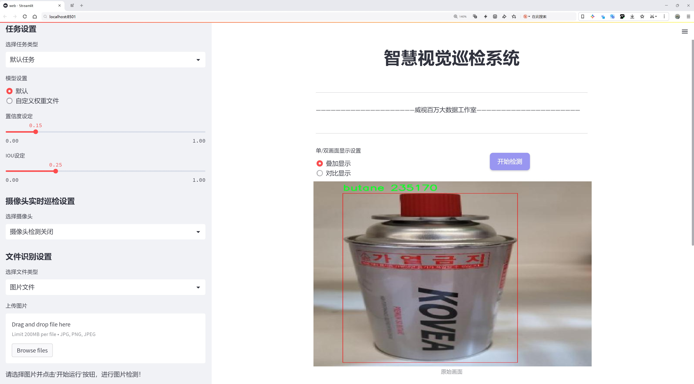
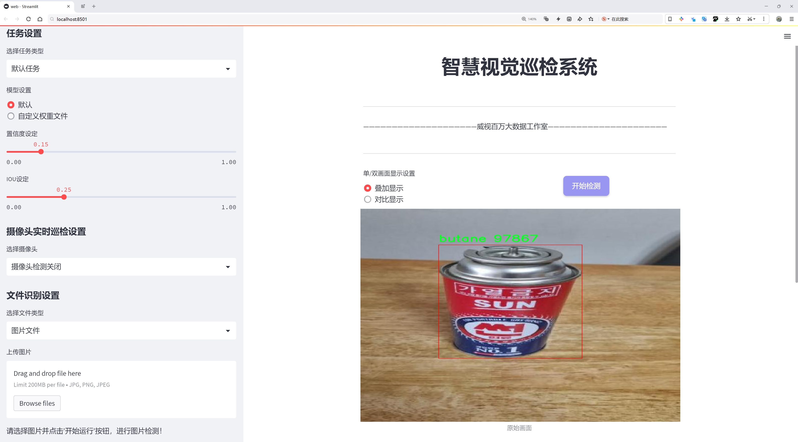
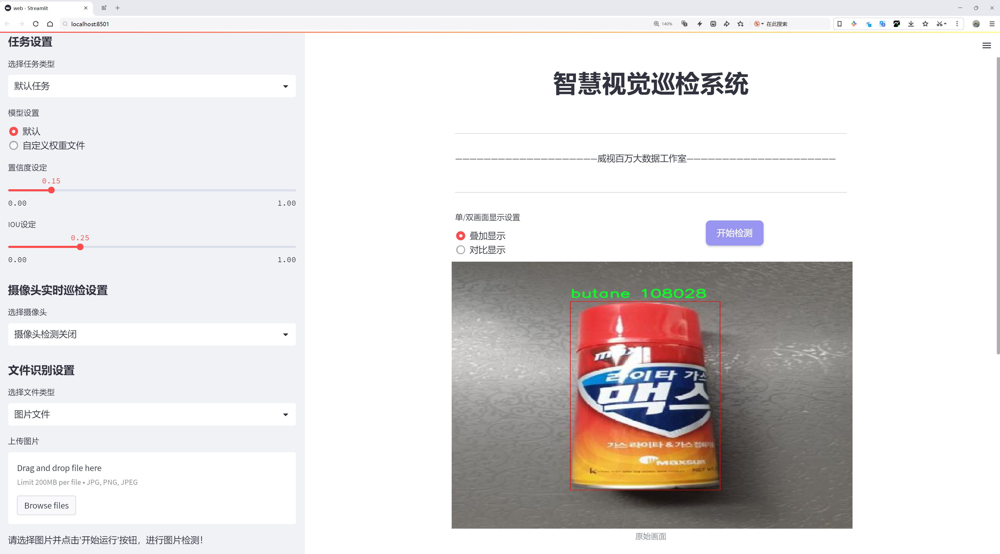
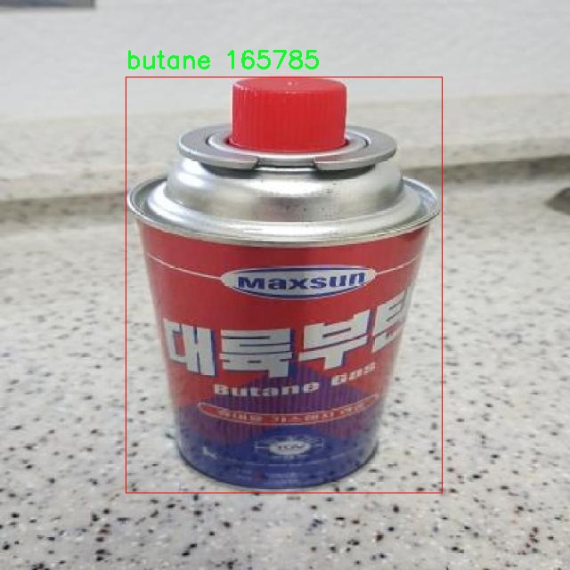
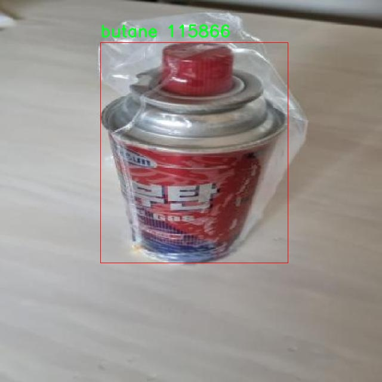
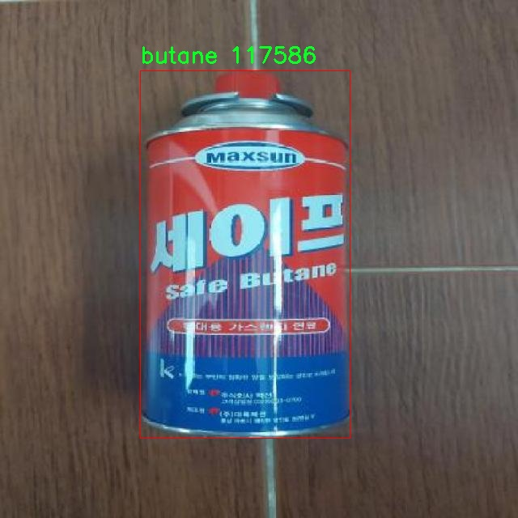
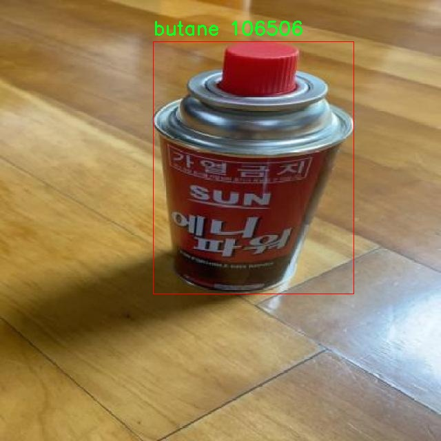
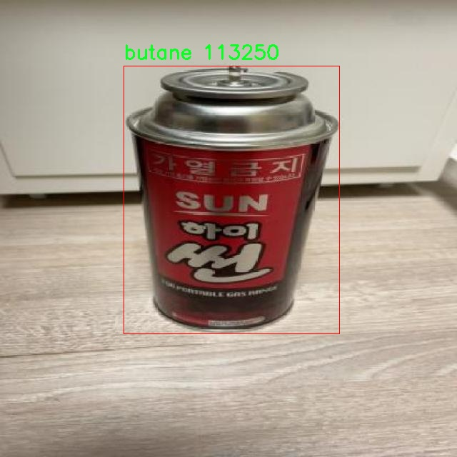

# 丁烷检测检测系统源码分享
 # [一条龙教学YOLOV8标注好的数据集一键训练_70+全套改进创新点发刊_Web前端展示]

### 1.研究背景与意义

项目参考[AAAI Association for the Advancement of Artificial Intelligence](https://gitee.com/qunshansj/projects)

项目来源[AACV Association for the Advancement of Computer Vision](https://gitee.com/qunmasj/projects)

研究背景与意义

丁烷作为一种重要的烃类气体，广泛应用于工业、家庭和交通等多个领域。其具有良好的燃烧性能和经济性，然而，丁烷的泄漏和不当使用也可能引发严重的安全隐患，如火灾、爆炸等。因此，及时、准确地检测丁烷的存在对于保障人们的生命财产安全具有重要意义。近年来，随着计算机视觉和深度学习技术的迅猛发展，基于图像处理的气体检测系统逐渐成为研究的热点。其中，YOLO（You Only Look Once）系列模型因其高效的实时检测能力而受到广泛关注。YOLOv8作为该系列的最新版本，具备更强的特征提取能力和更快的推理速度，为丁烷检测提供了新的技术路径。

在丁烷检测的研究中，数据集的构建是一个至关重要的环节。本研究所使用的丁烷数据集包含2300张图像，涵盖了丁烷这一类别的多样性。这些图像不仅包括了不同环境下的丁烷容器、管道和泄漏场景，还考虑了不同光照、角度和背景的变化，确保了模型训练的全面性和有效性。通过对这些图像的标注和分类，研究者能够训练出更为精准的检测模型，提升丁烷检测的准确率和可靠性。

改进YOLOv8模型的研究不仅是对现有技术的延续，更是对其在特定应用场景下的优化。通过对YOLOv8模型的改进，可以在保证检测速度的同时，提升对丁烷的检测精度。例如，可以通过引入注意力机制、数据增强技术以及优化损失函数等手段，增强模型对丁烷特征的敏感性，从而提高其在复杂环境下的检测能力。此外，改进后的模型还可以通过迁移学习等方式，利用已有的相关数据集进行预训练，进一步提升模型的泛化能力。

本研究的意义不仅在于技术层面的创新，更在于其实际应用价值。随着城市化进程的加快和工业化水平的提高，丁烷的使用频率不断增加，相关的安全隐患也随之加剧。因此，构建一个高效、准确的丁烷检测系统，对于保障公共安全、减少事故发生具有重要的现实意义。通过改进YOLOv8模型，我们期望能够为丁烷的实时监测提供一种新的解决方案，为相关行业的安全管理提供技术支持。

综上所述，基于改进YOLOv8的丁烷检测系统的研究，不仅具有重要的学术价值，也为实际应用提供了切实可行的技术方案。随着研究的深入，我们期待能够为丁烷检测领域带来新的突破，为保障人们的安全贡献一份力量。

### 2.图片演示







##### 注意：由于此博客编辑较早，上面“2.图片演示”和“3.视频演示”展示的系统图片或者视频可能为老版本，新版本在老版本的基础上升级如下：（实际效果以升级的新版本为准）

  （1）适配了YOLOV8的“目标检测”模型和“实例分割”模型，通过加载相应的权重（.pt）文件即可自适应加载模型。

  （2）支持“图片识别”、“视频识别”、“摄像头实时识别”三种识别模式。

  （3）支持“图片识别”、“视频识别”、“摄像头实时识别”三种识别结果保存导出，解决手动导出（容易卡顿出现爆内存）存在的问题，识别完自动保存结果并导出到tempDir中。

  （4）支持Web前端系统中的标题、背景图等自定义修改，后面提供修改教程。

  另外本项目提供训练的数据集和训练教程,暂不提供权重文件（best.pt）,需要您按照教程进行训练后实现图片演示和Web前端界面演示的效果。

### 3.视频演示

[3.1 视频演示](https://www.bilibili.com/video/BV1Er4neSELB/)

### 4.数据集信息展示

##### 4.1 本项目数据集详细数据（类别数＆类别名）

nc: 1
names: ['butane']


##### 4.2 本项目数据集信息介绍

数据集信息展示

在本研究中，我们采用了名为“butane”的数据集，以训练和改进YOLOv8模型，旨在提升丁烷检测系统的性能和准确性。该数据集专注于丁烷这一特定类别，具有单一类别的特征，便于模型的专注训练和优化。数据集的类别数量为1，类别列表中仅包含“butane”这一项，充分体现了数据集的针对性和专业性。

丁烷是一种广泛应用于燃料和化工领域的烃类物质，其检测和监测在安全管理和环境保护中具有重要意义。随着工业化进程的加快，丁烷的使用频率不断增加，随之而来的安全隐患也日益突出。因此，构建一个高效的丁烷检测系统显得尤为重要。为此，我们选择了YOLOv8这一先进的目标检测模型，因其在实时检测和高准确率方面的优势，使其成为本研究的理想选择。

“butane”数据集的构建过程经过精心设计，确保数据的多样性和代表性。数据集中包含了多种场景下的丁烷图像，这些图像涵盖了不同的环境条件、光照变化以及丁烷容器的不同外观。这种多样性不仅增强了模型的泛化能力，还提高了其在实际应用中的适应性。通过对丁烷的多角度、多场景的图像采集，数据集为YOLOv8模型提供了丰富的训练样本，助力模型在各种情况下的准确识别。

在数据集的标注过程中，我们采用了严格的标注标准，确保每一张图像中的丁烷目标都被准确标识。这一过程不仅包括丁烷容器的识别，还涉及到背景环境的处理，以避免模型在训练过程中受到干扰。通过高质量的标注，数据集为YOLOv8模型的训练提供了坚实的基础，使其能够有效学习到丁烷的特征和模式。

此外，为了进一步提升模型的性能，我们在数据集的使用过程中进行了数据增强处理。这一过程包括对图像的旋转、缩放、裁剪和颜色调整等操作，旨在增加数据集的多样性，提升模型的鲁棒性。通过这种方式，我们能够模拟出更多的实际应用场景，从而提高模型在真实环境中的表现。

在模型训练阶段，我们将“butane”数据集与YOLOv8模型相结合，进行了一系列实验和调优。通过不断迭代训练和验证，我们逐步优化了模型的参数设置，提升了其在丁烷检测任务中的准确率和召回率。最终，我们期望通过这一研究，不仅能够实现对丁烷的高效检测，还能为相关领域的安全管理提供有力支持。

综上所述，“butane”数据集为本研究提供了坚实的基础，凭借其专一性和高质量的标注，助力YOLOv8模型在丁烷检测任务中的成功应用。我们相信，通过不断的研究和优化，丁烷检测系统将能够在实际应用中发挥重要作用，为安全生产和环境保护贡献力量。











### 5.全套项目环境部署视频教程（零基础手把手教学）

[5.1 环境部署教程链接（零基础手把手教学）](https://www.ixigua.com/7404473917358506534?logTag=c807d0cbc21c0ef59de5)


[5.2 安装Python虚拟环境创建和依赖库安装视频教程链接（零基础手把手教学）](https://www.ixigua.com/7404474678003106304?logTag=1f1041108cd1f708b01a)

### 6.手把手YOLOV8训练视频教程（零基础小白有手就能学会）

[6.1 手把手YOLOV8训练视频教程（零基础小白有手就能学会）](https://www.ixigua.com/7404477157818401292?logTag=d31a2dfd1983c9668658)

### 7.70+种全套YOLOV8创新点代码加载调参视频教程（一键加载写好的改进模型的配置文件）

[7.1 70+种全套YOLOV8创新点代码加载调参视频教程（一键加载写好的改进模型的配置文件）](https://www.ixigua.com/7404478314661806627?logTag=29066f8288e3f4eea3a4)

### 8.70+种全套YOLOV8创新点原理讲解（非科班也可以轻松写刊发刊，V10版本正在科研待更新）

由于篇幅限制，每个创新点的具体原理讲解就不一一展开，具体见下列网址中的创新点对应子项目的技术原理博客网址【Blog】：


[8.1 70+种全套YOLOV8创新点原理讲解链接](https://gitee.com/qunmasj/good)

### 9.系统功能展示（检测对象为举例，实际内容以本项目数据集为准）

图9.1.系统支持检测结果表格显示

  图9.2.系统支持置信度和IOU阈值手动调节

  图9.3.系统支持自定义加载权重文件best.pt(需要你通过步骤5中训练获得)

  图9.4.系统支持摄像头实时识别

  图9.5.系统支持图片识别

  图9.6.系统支持视频识别

  图9.7.系统支持识别结果文件自动保存

  图9.8.系统支持Excel导出检测结果数据


### 10.原始YOLOV8算法原理

原始YOLOv8算法原理

YOLOv8算法是目标检测领域的一项重要进展，继承了YOLO系列的传统，并在此基础上进行了多项创新与改进。作为一种一阶段目标检测算法，YOLOv8将目标检测任务转化为回归问题，通过一个统一的神经网络模型同时预测目标的位置和类别。这种方法的核心在于其高效性和实时性，使得YOLOv8在实际应用中能够快速响应并提供准确的检测结果。

YOLOv8的网络结构由三个主要部分组成：Backbone、Neck和Head。Backbone部分负责特征提取，Neck部分则用于特征融合，而Head部分则执行最终的目标检测和分类任务。具体而言，Backbone采用了一系列卷积和反卷积层，结合残差连接和瓶颈结构，以减少网络的复杂性并提升性能。YOLOv8引入了C2模块作为基本构成单元，通过5个CBS模块、4个C2f模块和1个快速空间金字塔池化(SPPF)模块的组合，形成了高效的特征提取机制。

在特征融合方面，Neck部分采用了多尺度特征融合技术，利用来自Backbone不同阶段的特征图进行融合，以便更好地捕捉不同尺度目标的信息。这种融合策略显著提高了目标检测的性能和鲁棒性，使得YOLOv8能够在复杂场景中有效识别各种尺寸的目标。

Head部分负责最终的目标检测和分类任务。YOLOv8的检测头设计为解耦结构，将分类和定位任务分为两个独立的分支。通过这种解耦，YOLOv8能够更专注于每个任务，从而解决复杂场景下定位不准及分类错误的问题。检测头中包含一系列卷积层和反卷积层，用于生成检测结果，确保网络能够在不同尺寸的信息下有效检测目标。

YOLOv8在数据预处理方面延续了YOLOv5的策略，采用了马赛克增强、混合增强、空间扰动和颜色扰动等多种增强手段，以提高模型的鲁棒性和泛化能力。此外，YOLOv8在骨干网络结构上也做出了改进，原有的C3模块被替换为新的C2f模块，后者引入了更多的分支，丰富了梯度回传时的支流，进一步提升了特征提取的效率。

值得注意的是，YOLOv8在标签分配策略上进行了创新，采用了动态标签分配策略TOOD，而非依赖于固定的候选框。这一策略解决了正负样本匹配的多尺度分配问题，使得模型在训练过程中能够更灵活地适应不同的数据集。YOLOv8的损失函数设计也有所优化，分类损失采用了Varifocal Loss，回归损失则结合了CIoULoss与DFLLoss。这种设计使得模型在训练时能够更有效地关注高质量的正样本，同时降低负样本对损失的影响，从而提升整体检测性能。

YOLOv8的Anchor-free目标检测方法是一大亮点，它直接预测目标的位置和大小，避免了传统方法中预先定义锚点框的繁琐过程。这种基于回归的方式使得网络能够更快地聚焦于目标位置的邻近点，进而使得预测框更接近于实际边界框区域。这一创新不仅提升了检测精度，也显著简化了模型的设计和实现。

总的来说，YOLOv8算法在多个方面对前代YOLO模型进行了有效的改进，结合了高效的特征提取、灵活的特征融合和精准的目标检测策略，使得其在训练时间和检测精度上均得到了显著提升。得益于其轻量化的模型权重，YOLOv8能够在各种嵌入式设备上顺利部署，满足实时检测的需求。随着YOLOv8的推出，目标检测技术的应用场景将更加广泛，推动着智能视觉系统的进一步发展。


### 11.项目核心源码讲解（再也不用担心看不懂代码逻辑）

#### 11.1 70+种YOLOv8算法改进源码大全和调试加载训练教程（非必要）\ultralytics\nn\backbone\lsknet.py

以下是对代码的核心部分进行分析和详细注释的结果：

```python
import torch
import torch.nn as nn
from torch.nn.modules.utils import _pair as to_2tuple
from timm.layers import DropPath
from functools import partial

# 定义一个多层感知机（MLP）模块
class Mlp(nn.Module):
    def __init__(self, in_features, hidden_features=None, out_features=None, act_layer=nn.GELU, drop=0.):
        super().__init__()
        out_features = out_features or in_features  # 输出特征数
        hidden_features = hidden_features or in_features  # 隐藏层特征数
        # 定义两个1x1卷积层和一个深度卷积层
        self.fc1 = nn.Conv2d(in_features, hidden_features, 1)
        self.dwconv = DWConv(hidden_features)  # 深度卷积
        self.act = act_layer()  # 激活函数
        self.fc2 = nn.Conv2d(hidden_features, out_features, 1)
        self.drop = nn.Dropout(drop)  # Dropout层

    def forward(self, x):
        x = self.fc1(x)  # 通过第一个卷积层
        x = self.dwconv(x)  # 深度卷积
        x = self.act(x)  # 激活
        x = self.drop(x)  # Dropout
        x = self.fc2(x)  # 通过第二个卷积层
        x = self.drop(x)  # Dropout
        return x

# 定义LSK块
class LSKblock(nn.Module):
    def __init__(self, dim):
        super().__init__()
        # 定义多个卷积层
        self.conv0 = nn.Conv2d(dim, dim, 5, padding=2, groups=dim)  # 深度卷积
        self.conv_spatial = nn.Conv2d(dim, dim, 7, stride=1, padding=9, groups=dim, dilation=3)  # 空间卷积
        self.conv1 = nn.Conv2d(dim, dim//2, 1)  # 1x1卷积
        self.conv2 = nn.Conv2d(dim, dim//2, 1)  # 1x1卷积
        self.conv_squeeze = nn.Conv2d(2, 2, 7, padding=3)  # 压缩卷积
        self.conv = nn.Conv2d(dim//2, dim, 1)  # 1x1卷积

    def forward(self, x):   
        attn1 = self.conv0(x)  # 第一个注意力分支
        attn2 = self.conv_spatial(attn1)  # 第二个注意力分支

        attn1 = self.conv1(attn1)  # 处理第一个分支
        attn2 = self.conv2(attn2)  # 处理第二个分支
        
        # 将两个分支的输出进行拼接
        attn = torch.cat([attn1, attn2], dim=1)
        avg_attn = torch.mean(attn, dim=1, keepdim=True)  # 平均注意力
        max_attn, _ = torch.max(attn, dim=1, keepdim=True)  # 最大注意力
        agg = torch.cat([avg_attn, max_attn], dim=1)  # 拼接平均和最大注意力
        sig = self.conv_squeeze(agg).sigmoid()  # 压缩并激活
        # 通过sigmoid加权两个分支
        attn = attn1 * sig[:,0,:,:].unsqueeze(1) + attn2 * sig[:,1,:,:].unsqueeze(1)
        attn = self.conv(attn)  # 最后卷积
        return x * attn  # 输入与注意力相乘

# 定义注意力模块
class Attention(nn.Module):
    def __init__(self, d_model):
        super().__init__()
        self.proj_1 = nn.Conv2d(d_model, d_model, 1)  # 1x1卷积
        self.activation = nn.GELU()  # 激活函数
        self.spatial_gating_unit = LSKblock(d_model)  # LSK块
        self.proj_2 = nn.Conv2d(d_model, d_model, 1)  # 1x1卷积

    def forward(self, x):
        shorcut = x.clone()  # 保存输入以进行残差连接
        x = self.proj_1(x)  # 通过第一个卷积
        x = self.activation(x)  # 激活
        x = self.spatial_gating_unit(x)  # 通过空间门控单元
        x = self.proj_2(x)  # 通过第二个卷积
        x = x + shorcut  # 残差连接
        return x

# 定义整个LSK网络
class LSKNet(nn.Module):
    def __init__(self, img_size=224, in_chans=3, embed_dims=[64, 128, 256, 512],
                 mlp_ratios=[8, 8, 4, 4], drop_rate=0., drop_path_rate=0., 
                 depths=[3, 4, 6, 3], num_stages=4):
        super().__init__()
        
        self.depths = depths
        self.num_stages = num_stages

        # 计算随机深度衰减规则
        dpr = [x.item() for x in torch.linspace(0, drop_path_rate, sum(depths))]
        cur = 0

        # 构建每个阶段的网络结构
        for i in range(num_stages):
            patch_embed = OverlapPatchEmbed(img_size=img_size if i == 0 else img_size // (2 ** (i + 1)),
                                            patch_size=7 if i == 0 else 3,
                                            stride=4 if i == 0 else 2,
                                            in_chans=in_chans if i == 0 else embed_dims[i - 1],
                                            embed_dim=embed_dims[i])

            block = nn.ModuleList([Block(
                dim=embed_dims[i], mlp_ratio=mlp_ratios[i], drop=drop_rate, drop_path=dpr[cur + j])
                for j in range(depths[i])])
            norm = nn.LayerNorm(embed_dims[i])  # 归一化层
            cur += depths[i]

            setattr(self, f"patch_embed{i + 1}", patch_embed)  # 动态设置属性
            setattr(self, f"block{i + 1}", block)
            setattr(self, f"norm{i + 1}", norm)

    def forward(self, x):
        B = x.shape[0]  # 批大小
        outs = []
        for i in range(self.num_stages):
            patch_embed = getattr(self, f"patch_embed{i + 1}")
            block = getattr(self, f"block{i + 1}")
            norm = getattr(self, f"norm{i + 1}")
            x, H, W = patch_embed(x)  # 嵌入图像块
            for blk in block:
                x = blk(x)  # 通过每个块
            x = norm(x)  # 归一化
            outs.append(x)  # 保存输出
        return outs  # 返回所有阶段的输出

# 定义深度卷积模块
class DWConv(nn.Module):
    def __init__(self, dim=768):
        super(DWConv, self).__init__()
        self.dwconv = nn.Conv2d(dim, dim, 3, 1, 1, bias=True, groups=dim)  # 深度卷积

    def forward(self, x):
        x = self.dwconv(x)  # 通过深度卷积
        return x

# 定义模型的构建函数
def lsknet_t(weights=''):
    model = LSKNet(embed_dims=[32, 64, 160, 256], depths=[3, 3, 5, 2])
    if weights:
        model.load_state_dict(torch.load(weights)['state_dict'])  # 加载权重
    return model

if __name__ == '__main__':
    model = lsknet_t('lsk_t_backbone-2ef8a593.pth')  # 创建模型实例
    inputs = torch.randn((1, 3, 640, 640))  # 随机输入
    for i in model(inputs):
        print(i.size())  # 输出每个阶段的输出尺寸
```

### 代码分析总结：
1. **Mlp类**：实现了一个多层感知机，包括两个1x1卷积层和一个深度卷积层，使用GELU激活函数和Dropout。
2. **LSKblock类**：实现了一个注意力机制块，包含多个卷积层和注意力计算，结合了平均和最大池化的注意力。
3. **Attention类**：实现了一个注意力模块，使用残差连接和激活函数。
4. **LSKNet类**：构建了整个网络结构，包括多个阶段的嵌入、块和归一化层。
5. **DWConv类**：实现了深度卷积，用于特征提取。
6. **lsknet_t函数**：用于创建LSKNet模型并加载预训练权重。

这些核心部分构成了一个复杂的神经网络架构，适用于图像处理任务。

该文件实现了一个名为LSKNet的深度学习模型，主要用于图像处理任务。首先，文件导入了必要的库，包括PyTorch和一些特定的模块。接下来，定义了多个类，每个类实现了网络的不同部分。

首先，`Mlp`类实现了一个多层感知机（MLP），包含两个卷积层和一个深度卷积层（DWConv），并使用GELU激活函数和Dropout进行正则化。其前向传播方法依次通过这些层处理输入数据。

`LSKblock`类是一个特殊的块，包含多个卷积层和注意力机制。它首先通过深度卷积和空间卷积生成两个特征图，然后将这两个特征图进行处理，计算它们的平均值和最大值，最终通过一个卷积层生成注意力权重，并将其应用于输入特征图。

`Attention`类实现了一个注意力机制，通过两个卷积层和一个LSKblock来增强特征表示。它在前向传播中将输入与经过注意力机制处理后的特征相加，以实现信息的融合。

`Block`类结合了归一化、注意力机制和MLP，构成了模型的基本构建块。它使用Batch Normalization进行归一化，并通过DropPath实现随机深度，增加模型的鲁棒性。

`OverlapPatchEmbed`类将输入图像分割成重叠的补丁，并通过卷积层将其嵌入到更高维度的空间中。它还包含Batch Normalization以增强特征表示。

`LSKNet`类是整个网络的主体，包含多个阶段（num_stages），每个阶段由Patch Embedding、Block和归一化层组成。模型的前向传播方法依次通过每个阶段，提取特征并进行处理，最终返回多个输出。

`DWConv`类实现了深度卷积，用于在`Mlp`类中处理特征图。

`update_weight`函数用于更新模型的权重，确保模型字典中的权重与加载的权重字典匹配。

`lsknet_t`和`lsknet_s`函数分别定义了两种不同配置的LSKNet模型，允许用户加载预训练权重。

最后，在主程序中，创建了一个LSKNet模型实例，并对一个随机生成的输入进行前向传播，打印出每个输出的尺寸。这一部分用于测试模型的构建和前向传播是否正常。整体上，该文件实现了一个灵活且强大的图像处理模型，适用于多种视觉任务。

#### 11.2 code\ultralytics\models\yolo\detect\train.py

以下是代码中最核心的部分，并附上详细的中文注释：

```python
class DetectionTrainer(BaseTrainer):
    """
    DetectionTrainer类，继承自BaseTrainer类，用于基于检测模型的训练。
    """

    def build_dataset(self, img_path, mode="train", batch=None):
        """
        构建YOLO数据集。

        参数:
            img_path (str): 包含图像的文件夹路径。
            mode (str): 模式，可以是'train'或'val'，用户可以为每种模式自定义不同的数据增强。
            batch (int, optional): 批次大小，仅在'rect'模式下使用。默认为None。
        """
        gs = max(int(de_parallel(self.model).stride.max() if self.model else 0), 32)
        return build_yolo_dataset(self.args, img_path, batch, self.data, mode=mode, rect=mode == "val", stride=gs)

    def get_dataloader(self, dataset_path, batch_size=16, rank=0, mode="train"):
        """构造并返回数据加载器。"""
        assert mode in ["train", "val"]  # 确保模式有效
        with torch_distributed_zero_first(rank):  # 在分布式环境中仅初始化一次数据集
            dataset = self.build_dataset(dataset_path, mode, batch_size)
        shuffle = mode == "train"  # 训练模式下打乱数据
        if getattr(dataset, "rect", False) and shuffle:
            LOGGER.warning("WARNING ⚠️ 'rect=True'与DataLoader的shuffle不兼容，设置shuffle=False")
            shuffle = False
        workers = self.args.workers if mode == "train" else self.args.workers * 2  # 根据模式设置工作线程数
        return build_dataloader(dataset, batch_size, workers, shuffle, rank)  # 返回数据加载器

    def preprocess_batch(self, batch):
        """对一批图像进行预处理，包括缩放和转换为浮点数。"""
        batch["img"] = batch["img"].to(self.device, non_blocking=True).float() / 255  # 将图像转换为浮点数并归一化
        if self.args.multi_scale:  # 如果启用多尺度训练
            imgs = batch["img"]
            sz = (
                random.randrange(self.args.imgsz * 0.5, self.args.imgsz * 1.5 + self.stride)
                // self.stride
                * self.stride
            )  # 随机选择一个新的尺寸
            sf = sz / max(imgs.shape[2:])  # 计算缩放因子
            if sf != 1:
                ns = [
                    math.ceil(x * sf / self.stride) * self.stride for x in imgs.shape[2:]
                ]  # 计算新的形状
                imgs = nn.functional.interpolate(imgs, size=ns, mode="bilinear", align_corners=False)  # 进行插值缩放
            batch["img"] = imgs  # 更新批次中的图像
        return batch

    def get_model(self, cfg=None, weights=None, verbose=True):
        """返回YOLO检测模型。"""
        model = DetectionModel(cfg, nc=self.data["nc"], verbose=verbose and RANK == -1)  # 创建检测模型
        if weights:
            model.load(weights)  # 加载权重
        return model

    def get_validator(self):
        """返回用于YOLO模型验证的DetectionValidator。"""
        self.loss_names = "box_loss", "cls_loss", "dfl_loss"  # 定义损失名称
        return yolo.detect.DetectionValidator(
            self.test_loader, save_dir=self.save_dir, args=copy(self.args), _callbacks=self.callbacks
        )

    def plot_training_samples(self, batch, ni):
        """绘制带有注释的训练样本。"""
        plot_images(
            images=batch["img"],
            batch_idx=batch["batch_idx"],
            cls=batch["cls"].squeeze(-1),
            bboxes=batch["bboxes"],
            paths=batch["im_file"],
            fname=self.save_dir / f"train_batch{ni}.jpg",
            on_plot=self.on_plot,
        )
```

### 代码说明：
1. **DetectionTrainer类**：这是一个用于训练YOLO检测模型的类，继承自基础训练类`BaseTrainer`。
2. **build_dataset方法**：构建YOLO数据集，接收图像路径、模式和批次大小作为参数。
3. **get_dataloader方法**：构造数据加载器，支持训练和验证模式，并根据模式设置是否打乱数据。
4. **preprocess_batch方法**：对输入的图像批次进行预处理，包括归一化和可能的多尺度调整。
5. **get_model方法**：返回一个YOLO检测模型，支持加载预训练权重。
6. **get_validator方法**：返回一个用于模型验证的验证器。
7. **plot_training_samples方法**：绘制训练样本及其对应的注释，便于可视化训练过程。

这个程序文件是Ultralytics YOLO（You Only Look Once）模型的训练模块，主要用于目标检测任务。它继承自一个基类`BaseTrainer`，并提供了一系列方法来构建数据集、获取数据加载器、预处理图像、设置模型属性、获取模型、验证模型、记录损失、显示训练进度、绘制训练样本和绘制训练指标等。

首先，`DetectionTrainer`类的构造函数没有显示，但可以推测它会初始化一些基本参数和模型。`build_dataset`方法用于构建YOLO数据集，接收图像路径、模式（训练或验证）和批次大小作为参数。它通过调用`build_yolo_dataset`函数来创建数据集，并根据模型的步幅（stride）进行处理。

`get_dataloader`方法则用于构建数据加载器，确保在分布式训练时只初始化一次数据集，并根据模式选择是否打乱数据。它会根据训练或验证模式调整工作线程的数量，并返回构建好的数据加载器。

在图像预处理方面，`preprocess_batch`方法会将图像转换为浮点数并进行归一化处理。如果启用了多尺度训练，它还会随机调整图像的大小，并通过双线性插值方法调整图像的尺寸，以适应模型的输入要求。

`set_model_attributes`方法用于设置模型的属性，包括类别数量和类别名称，以便模型能够正确处理数据集中的不同类别。

`get_model`方法用于返回一个YOLO检测模型实例，并可选择加载预训练权重。`get_validator`方法则返回一个用于验证YOLO模型的验证器。

在损失记录方面，`label_loss_items`方法会返回一个包含训练损失项的字典，方便后续的损失分析。`progress_string`方法则返回一个格式化的字符串，用于显示训练进度，包括当前的epoch、GPU内存使用情况、损失值、实例数量和图像大小等信息。

此外，`plot_training_samples`方法用于绘制训练样本及其标注，`plot_metrics`方法用于从CSV文件中绘制训练指标，`plot_training_labels`方法则创建一个带标签的训练图，以可视化训练数据的分布情况。

整体来看，这个文件提供了YOLO模型训练所需的基本功能，便于用户进行目标检测任务的训练和评估。

#### 11.3 ui.py

以下是经过简化并添加详细中文注释的核心代码部分：

```python
import sys
import subprocess

def run_script(script_path):
    """
    使用当前 Python 环境运行指定的脚本。

    Args:
        script_path (str): 要运行的脚本路径

    Returns:
        None
    """
    # 获取当前 Python 解释器的路径
    python_path = sys.executable

    # 构建运行命令，使用 streamlit 运行指定的脚本
    command = f'"{python_path}" -m streamlit run "{script_path}"'

    # 执行命令
    result = subprocess.run(command, shell=True)
    
    # 检查命令执行结果，如果返回码不为0，则表示出错
    if result.returncode != 0:
        print("脚本运行出错。")

# 实例化并运行应用
if __name__ == "__main__":
    # 指定要运行的脚本路径
    script_path = "web.py"  # 假设脚本在当前目录下

    # 调用函数运行脚本
    run_script(script_path)
```

### 代码说明：
1. **导入模块**：
   - `sys`：用于获取当前 Python 解释器的路径。
   - `subprocess`：用于执行外部命令。

2. **定义 `run_script` 函数**：
   - 该函数接受一个参数 `script_path`，表示要运行的 Python 脚本的路径。
   - 使用 `sys.executable` 获取当前 Python 解释器的路径。
   - 构建一个命令字符串，使用 `streamlit` 运行指定的脚本。
   - 使用 `subprocess.run` 执行命令，并检查返回码以判断脚本是否成功运行。

3. **主程序入口**：
   - 当脚本作为主程序运行时，指定要运行的脚本路径（这里假设为 `web.py`）。
   - 调用 `run_script` 函数执行该脚本。

这个程序文件名为 `ui.py`，其主要功能是使用当前的 Python 环境来运行一个指定的脚本，具体是一个名为 `web.py` 的 Streamlit 应用。

首先，程序导入了几个必要的模块，包括 `sys`、`os` 和 `subprocess`。`sys` 模块用于访问与 Python 解释器相关的变量和函数，`os` 模块提供了与操作系统交互的功能，而 `subprocess` 模块则用于创建新进程、连接到它们的输入/输出/错误管道，并获取它们的返回码。

接下来，程序从 `QtFusion.path` 模块中导入了 `abs_path` 函数，这个函数的作用是获取给定路径的绝对路径。

在 `run_script` 函数中，程序接收一个参数 `script_path`，这个参数是要运行的脚本的路径。函数首先获取当前 Python 解释器的路径，并将其存储在 `python_path` 变量中。然后，程序构建了一个命令字符串，该命令用于运行指定的脚本，具体是通过 `streamlit run` 命令来启动 Streamlit 应用。

接着，程序使用 `subprocess.run` 方法执行构建好的命令。这个方法会在新的 shell 中运行命令，并等待命令执行完成。如果命令的返回码不为零，表示脚本运行过程中出现了错误，程序会打印出“脚本运行出错。”的提示信息。

在文件的最后部分，程序通过 `if __name__ == "__main__":` 语句来确保只有在直接运行该脚本时才会执行后面的代码。在这里，程序调用 `abs_path` 函数来获取 `web.py` 的绝对路径，并将其存储在 `script_path` 变量中。最后，程序调用 `run_script` 函数，传入 `script_path`，以启动指定的 Streamlit 应用。

总的来说，这个程序的主要目的是方便用户在当前 Python 环境中运行一个 Streamlit 应用，通过指定脚本路径来实现。

#### 11.4 code\ultralytics\models\yolo\pose\predict.py

以下是代码中最核心的部分，并附上详细的中文注释：

```python
from ultralytics.engine.results import Results  # 导入结果处理类
from ultralytics.models.yolo.detect.predict import DetectionPredictor  # 导入检测预测类
from ultralytics.utils import DEFAULT_CFG, LOGGER, ops  # 导入默认配置、日志记录器和操作工具

class PosePredictor(DetectionPredictor):
    """
    PosePredictor类，扩展自DetectionPredictor类，用于基于姿态模型的预测。
    """

    def __init__(self, cfg=DEFAULT_CFG, overrides=None, _callbacks=None):
        """初始化PosePredictor，设置任务为'pose'并记录使用'mps'作为设备的警告。"""
        super().__init__(cfg, overrides, _callbacks)  # 调用父类构造函数
        self.args.task = "pose"  # 设置任务类型为姿态预测
        # 检查设备类型，如果是Apple MPS，记录警告信息
        if isinstance(self.args.device, str) and self.args.device.lower() == "mps":
            LOGGER.warning(
                "WARNING ⚠️ Apple MPS known Pose bug. Recommend 'device=cpu' for Pose models. "
                "See https://github.com/ultralytics/ultralytics/issues/4031."
            )

    def postprocess(self, preds, img, orig_imgs):
        """返回给定输入图像或图像列表的检测结果。"""
        # 应用非极大值抑制，过滤掉低置信度的预测框
        preds = ops.non_max_suppression(
            preds,
            self.args.conf,  # 置信度阈值
            self.args.iou,  # IOU阈值
            agnostic=self.args.agnostic_nms,  # 是否对类别不敏感
            max_det=self.args.max_det,  # 最大检测框数量
            classes=self.args.classes,  # 选择的类别
            nc=len(self.model.names),  # 类别数量
        )

        # 如果输入图像不是列表，则将其转换为numpy数组
        if not isinstance(orig_imgs, list):
            orig_imgs = ops.convert_torch2numpy_batch(orig_imgs)

        results = []  # 初始化结果列表
        for i, pred in enumerate(preds):  # 遍历每个预测结果
            orig_img = orig_imgs[i]  # 获取原始图像
            # 将预测框的坐标缩放到原始图像的尺寸
            pred[:, :4] = ops.scale_boxes(img.shape[2:], pred[:, :4], orig_img.shape).round()
            # 获取关键点预测，处理成指定形状
            pred_kpts = pred[:, 6:].view(len(pred), *self.model.kpt_shape) if len(pred) else pred[:, 6:]
            # 将关键点坐标缩放到原始图像的尺寸
            pred_kpts = ops.scale_coords(img.shape[2:], pred_kpts, orig_img.shape)
            img_path = self.batch[0][i]  # 获取图像路径
            # 将结果添加到结果列表中
            results.append(
                Results(orig_img, path=img_path, names=self.model.names, boxes=pred[:, :6], keypoints=pred_kpts)
            )
        return results  # 返回处理后的结果
```

### 代码核心部分说明：
1. **PosePredictor类**：该类用于姿态预测，继承自`DetectionPredictor`，可以利用YOLO模型进行姿态检测。
2. **初始化方法**：设置任务类型为姿态预测，并对使用特定设备（如Apple MPS）时发出警告。
3. **后处理方法**：对模型的预测结果进行处理，包括应用非极大值抑制、坐标缩放等，最终返回包含检测框和关键点的结果。

这个程序文件定义了一个名为 `PosePredictor` 的类，该类继承自 `DetectionPredictor`，用于基于姿态模型进行预测。文件开头引入了一些必要的模块和类，包括 `Results`、`DetectionPredictor` 和一些工具函数。

在 `PosePredictor` 类的构造函数 `__init__` 中，首先调用了父类的构造函数，并将任务类型设置为 "pose"。此外，如果设备类型是 "mps"（即苹果的金属性能计算），则会发出警告，建议使用 "cpu" 设备，因为在使用姿态模型时，"mps" 可能存在已知的bug。

类中还定义了一个 `postprocess` 方法，该方法用于处理给定输入图像或图像列表的检测结果。首先，使用非极大值抑制（NMS）对预测结果进行筛选，以去除冗余的检测框。接着，如果输入的原始图像不是列表形式，则将其转换为 NumPy 数组。

然后，程序遍历每个预测结果，获取对应的原始图像，并对预测框的坐标进行缩放，以适应原始图像的尺寸。接下来，提取关键点并进行相应的坐标缩放。最后，将处理后的结果存储在 `results` 列表中，并返回该列表。每个结果都包含原始图像、图像路径、模型名称、检测框和关键点信息。

这个类的设计使得用户可以方便地进行姿态检测，并能够处理和返回相关的检测结果。

#### 11.5 train.py

以下是经过简化并添加详细中文注释的核心代码部分：

```python
import random
import numpy as np
import torch.nn as nn
from ultralytics.data import build_dataloader, build_yolo_dataset
from ultralytics.engine.trainer import BaseTrainer
from ultralytics.models import yolo
from ultralytics.nn.tasks import DetectionModel
from ultralytics.utils import LOGGER, RANK
from ultralytics.utils.torch_utils import de_parallel, torch_distributed_zero_first

class DetectionTrainer(BaseTrainer):
    """
    基于检测模型的训练类，继承自BaseTrainer类。
    """

    def build_dataset(self, img_path, mode="train", batch=None):
        """
        构建YOLO数据集。

        参数:
            img_path (str): 包含图像的文件夹路径。
            mode (str): 模式，`train`表示训练模式，`val`表示验证模式。
            batch (int, optional): 批次大小，适用于`rect`模式。默认为None。
        """
        gs = max(int(de_parallel(self.model).stride.max() if self.model else 0), 32)
        return build_yolo_dataset(self.args, img_path, batch, self.data, mode=mode, rect=mode == "val", stride=gs)

    def get_dataloader(self, dataset_path, batch_size=16, rank=0, mode="train"):
        """构造并返回数据加载器。"""
        assert mode in ["train", "val"]
        with torch_distributed_zero_first(rank):  # 在分布式环境中仅初始化一次数据集
            dataset = self.build_dataset(dataset_path, mode, batch_size)
        shuffle = mode == "train"  # 训练模式下打乱数据
        workers = self.args.workers if mode == "train" else self.args.workers * 2
        return build_dataloader(dataset, batch_size, workers, shuffle, rank)  # 返回数据加载器

    def preprocess_batch(self, batch):
        """对图像批次进行预处理，包括缩放和转换为浮点数。"""
        batch["img"] = batch["img"].to(self.device, non_blocking=True).float() / 255  # 将图像转换为浮点数并归一化
        if self.args.multi_scale:  # 如果启用多尺度训练
            imgs = batch["img"]
            sz = (
                random.randrange(self.args.imgsz * 0.5, self.args.imgsz * 1.5 + self.stride)
                // self.stride
                * self.stride
            )  # 随机选择新的尺寸
            sf = sz / max(imgs.shape[2:])  # 计算缩放因子
            if sf != 1:
                ns = [
                    math.ceil(x * sf / self.stride) * self.stride for x in imgs.shape[2:]
                ]  # 计算新的形状
                imgs = nn.functional.interpolate(imgs, size=ns, mode="bilinear", align_corners=False)  # 进行插值缩放
            batch["img"] = imgs
        return batch

    def get_model(self, cfg=None, weights=None, verbose=True):
        """返回YOLO检测模型。"""
        model = DetectionModel(cfg, nc=self.data["nc"], verbose=verbose and RANK == -1)
        if weights:
            model.load(weights)  # 加载预训练权重
        return model

    def plot_training_samples(self, batch, ni):
        """绘制带有注释的训练样本。"""
        plot_images(
            images=batch["img"],
            batch_idx=batch["batch_idx"],
            cls=batch["cls"].squeeze(-1),
            bboxes=batch["bboxes"],
            paths=batch["im_file"],
            fname=self.save_dir / f"train_batch{ni}.jpg",
            on_plot=self.on_plot,
        )
```

### 代码核心部分说明：
1. **`DetectionTrainer` 类**：这是一个用于训练YOLO检测模型的类，继承自基础训练类 `BaseTrainer`。
2. **`build_dataset` 方法**：根据给定的图像路径和模式构建YOLO数据集。
3. **`get_dataloader` 方法**：构造数据加载器，处理训练和验证模式下的数据。
4. **`preprocess_batch` 方法**：对输入的图像批次进行预处理，包括归一化和可选的多尺度调整。
5. **`get_model` 方法**：创建并返回一个YOLO检测模型，支持加载预训练权重。
6. **`plot_training_samples` 方法**：用于绘制训练样本及其注释，便于可视化训练过程中的数据。

以上是代码的核心部分和详细注释，旨在帮助理解YOLO模型的训练过程。

这个程序文件 `train.py` 是一个用于训练 YOLO（You Only Look Once）目标检测模型的实现，继承自 `BaseTrainer` 类。程序的主要功能是构建数据集、创建数据加载器、预处理图像批次、设置模型属性、获取模型、验证模型、记录损失、显示训练进度、绘制训练样本和指标等。

首先，程序导入了必要的库和模块，包括数学运算、随机数生成、深度学习框架 PyTorch 的神经网络模块、以及 Ultralytics 提供的各种工具和功能模块。接着定义了 `DetectionTrainer` 类，该类专门用于基于检测模型的训练。

在 `build_dataset` 方法中，程序构建了 YOLO 数据集，接受图像路径、模式（训练或验证）和批次大小作为参数。该方法使用 `build_yolo_dataset` 函数来创建数据集，并根据模型的步幅调整数据集的大小。

`get_dataloader` 方法则负责构建并返回数据加载器。它会根据训练或验证模式来决定是否打乱数据，并根据传入的参数配置数据加载器的工作线程数量。

`preprocess_batch` 方法用于对图像批次进行预处理，包括将图像缩放到合适的大小并转换为浮点数格式。这里还考虑了多尺度训练的情况，随机选择图像的大小并进行插值处理。

`set_model_attributes` 方法将数据集的类别数量和名称等属性附加到模型上，以便模型能够正确处理数据。

`get_model` 方法用于返回一个 YOLO 检测模型，并可以加载预训练的权重。

`get_validator` 方法返回一个用于模型验证的 `DetectionValidator` 实例，负责计算和记录损失。

`label_loss_items` 方法用于返回带有标签的训练损失项的字典，这对于目标检测任务是必要的。

`progress_string` 方法生成一个格式化的字符串，用于显示训练进度，包括当前的轮次、GPU 内存使用情况、损失值、实例数量和图像大小等信息。

`plot_training_samples` 方法用于绘制训练样本及其标注，方便可视化训练过程中的数据。

最后，`plot_metrics` 和 `plot_training_labels` 方法用于绘制训练过程中的指标和标签，分别从 CSV 文件中读取结果并生成可视化图像。

整体来看，这个程序文件提供了一个完整的训练框架，涵盖了数据处理、模型训练、验证和结果可视化等多个方面，适用于 YOLO 模型的训练任务。

#### 11.6 code\ultralytics\models\yolo\model.py

```python
# 导入所需的模块和类
from ultralytics.engine.model import Model
from ultralytics.models import yolo
from ultralytics.nn.tasks import ClassificationModel, DetectionModel, OBBModel, PoseModel, SegmentationModel

class YOLO(Model):
    """YOLO (You Only Look Once) 目标检测模型的定义。"""

    @property
    def task_map(self):
        """将任务类型映射到相应的模型、训练器、验证器和预测器类。"""
        return {
            "classify": {  # 分类任务
                "model": ClassificationModel,  # 使用的模型类
                "trainer": yolo.classify.ClassificationTrainer,  # 训练器类
                "validator": yolo.classify.ClassificationValidator,  # 验证器类
                "predictor": yolo.classify.ClassificationPredictor,  # 预测器类
            },
            "detect": {  # 检测任务
                "model": DetectionModel,  # 使用的模型类
                "trainer": yolo.detect.DetectionTrainer,  # 训练器类
                "validator": yolo.detect.DetectionValidator,  # 验证器类
                "predictor": yolo.detect.DetectionPredictor,  # 预测器类
            },
            "segment": {  # 分割任务
                "model": SegmentationModel,  # 使用的模型类
                "trainer": yolo.segment.SegmentationTrainer,  # 训练器类
                "validator": yolo.segment.SegmentationValidator,  # 验证器类
                "predictor": yolo.segment.SegmentationPredictor,  # 预测器类
            },
            "pose": {  # 姿态估计任务
                "model": PoseModel,  # 使用的模型类
                "trainer": yolo.pose.PoseTrainer,  # 训练器类
                "validator": yolo.pose.PoseValidator,  # 验证器类
                "predictor": yolo.pose.PosePredictor,  # 预测器类
            },
            "obb": {  # 方向边界框任务
                "model": OBBModel,  # 使用的模型类
                "trainer": yolo.obb.OBBTrainer,  # 训练器类
                "validator": yolo.obb.OBBValidator,  # 验证器类
                "predictor": yolo.obb.OBBPredictor,  # 预测器类
            },
        }
```

### 代码核心部分及注释说明：

1. **导入模块**：
   - 导入了 `Model` 类和 YOLO 相关的模型、训练器、验证器和预测器。

2. **YOLO 类**：
   - 继承自 `Model` 类，表示一个 YOLO 目标检测模型。

3. **task_map 属性**：
   - 该属性返回一个字典，映射不同的任务类型（如分类、检测、分割、姿态估计和方向边界框）到相应的模型、训练器、验证器和预测器类。
   - 每个任务都有其对应的模型和相关的处理类，便于在不同任务中复用相同的框架。

4. **任务类型**：
   - `"classify"`：用于图像分类的任务。
   - `"detect"`：用于目标检测的任务。
   - `"segment"`：用于图像分割的任务。
   - `"pose"`：用于姿态估计的任务。
   - `"obb"`：用于方向边界框的任务。

通过这种结构，可以方便地扩展和管理不同的计算机视觉任务，保持代码的清晰和可维护性。

这个程序文件定义了一个名为 `YOLO` 的类，该类继承自 `Model` 类，主要用于实现 YOLO（You Only Look Once）目标检测模型。文件开头包含了版权信息，表明该代码遵循 AGPL-3.0 许可证。

在 `YOLO` 类中，有一个名为 `task_map` 的属性方法。这个方法返回一个字典，字典的键是不同的任务类型（如分类、检测、分割、姿态估计和方向边界框），每个键对应的值又是一个字典，包含了与该任务相关的模型、训练器、验证器和预测器类。

具体来说，对于每种任务类型，`task_map` 中定义了以下内容：

- **classify**：与分类任务相关的模型和类，包括 `ClassificationModel`、`ClassificationTrainer`、`ClassificationValidator` 和 `ClassificationPredictor`。
- **detect**：与检测任务相关的模型和类，包括 `DetectionModel`、`DetectionTrainer`、`DetectionValidator` 和 `DetectionPredictor`。
- **segment**：与分割任务相关的模型和类，包括 `SegmentationModel`、`SegmentationTrainer`、`SegmentationValidator` 和 `SegmentationPredictor`。
- **pose**：与姿态估计任务相关的模型和类，包括 `PoseModel`、`PoseTrainer`、`PoseValidator` 和 `PosePredictor`。
- **obb**：与方向边界框任务相关的模型和类，包括 `OBBModel`、`OBBTrainer`、`OBBValidator` 和 `OBBPredictor`。

通过这种方式，`YOLO` 类能够灵活地映射不同的任务到相应的模型和处理类，使得在使用 YOLO 进行各种计算机视觉任务时，能够方便地选择和使用相应的功能。

### 12.系统整体结构（节选）

### 整体功能和构架概括

该程序整体上是一个用于实现和训练 YOLOv8（You Only Look Once）目标检测模型的框架，涵盖了从模型定义、训练、预测到可视化等多个方面。程序结构清晰，模块化设计使得各个功能模块相对独立，便于维护和扩展。主要功能包括：

1. **模型定义**：实现了不同类型的 YOLO 模型（如检测、分类、姿态估计等），并支持多种改进算法。
2. **数据处理**：提供了数据集构建、数据增强和预处理的功能，以适应不同的训练需求。
3. **训练与验证**：包含训练和验证的逻辑，能够记录损失和训练进度，并支持多种训练策略。
4. **预测与推理**：实现了对输入图像的推理功能，能够输出检测结果和关键点信息。
5. **可视化**：提供了可视化工具，用于绘制训练样本、损失曲线和其他指标，便于用户分析训练过程。

### 文件功能整理表

| 文件路径                                                                                   | 功能描述                                                                                     |
|------------------------------------------------------------------------------------------|--------------------------------------------------------------------------------------------|
| `70+种YOLOv8算法改进源码大全和调试加载训练教程（非必要）\ultralytics\nn\backbone\lsknet.py` | 实现 LSKNet 模型，包括多层感知机、注意力机制和深度卷积等模块，适用于图像处理任务。                      |
| `code\ultralytics\models\yolo\detect\train.py`                                         | 定义 YOLO 检测模型的训练逻辑，包括数据集构建、数据加载、模型训练和损失记录等功能。                     |
| `ui.py`                                                                                  | 启动 Streamlit 应用，方便用户在当前 Python 环境中运行指定的脚本。                               |
| `code\ultralytics\models\yolo\pose\predict.py`                                         | 实现姿态检测模型的预测功能，处理输入图像并返回检测结果和关键点信息。                             |
| `train.py`                                                                               | 提供训练 YOLO 模型的框架，包含数据处理、模型训练和验证等功能。                                   |
| `code\ultralytics\models\yolo\model.py`                                                | 定义 YOLO 模型类，映射不同任务（检测、分类、分割、姿态估计等）到相应的模型和处理类。                  |
| `70+种YOLOv8算法改进源码大全和调试加载训练教程（非必要）\ultralytics\utils\plotting.py`   | 提供可视化工具，用于绘制训练样本、损失曲线和其他指标，帮助用户分析训练过程。                       |
| `code\ultralytics\utils\callbacks\hub.py`                                              | 实现模型训练过程中的回调功能，支持模型的保存、加载和监控等。                                     |
| `70+种YOLOv8算法改进源码大全和调试加载训练教程（非必要）\ultralytics\models\yolo\classify\__init__.py` | 初始化分类模型模块，包含相关类和函数的导入。                                                |
| `code\ultralytics\trackers\byte_tracker.py`                                            | 实现 ByteTracker，用于目标跟踪任务，提供高效的目标跟踪算法。                                    |
| `70+种YOLOv8算法改进源码大全和调试加载训练教程（非必要）\ultralytics\models\yolo\classify\train.py` | 定义 YOLO 分类模型的训练逻辑，包含数据集构建、模型训练和验证等功能。                            |
| `code\ultralytics\data\augment.py`                                                     | 提供数据增强功能，包括图像的随机变换、裁剪和颜色调整等，以提高模型的泛化能力。                     |
| `70+种YOLOv8算法改进源码大全和调试加载训练教程（非必要）\ultralytics\solutions\__init__.py` | 初始化解决方案模块，包含相关类和函数的导入。                                                |

这个表格总结了各个文件的主要功能，帮助用户快速了解程序的结构和各个模块的作用。

注意：由于此博客编辑较早，上面“11.项目核心源码讲解（再也不用担心看不懂代码逻辑）”中部分代码可能会优化升级，仅供参考学习，完整“训练源码”、“Web前端界面”和“70+种创新点源码”以“13.完整训练+Web前端界面+70+种创新点源码、数据集获取”的内容为准。

### 13.完整训练+Web前端界面+70+种创新点源码、数据集获取


# [下载链接：https://mbd.pub/o/bread/ZpuUlZ1t](https://mbd.pub/o/bread/ZpuUlZ1t)